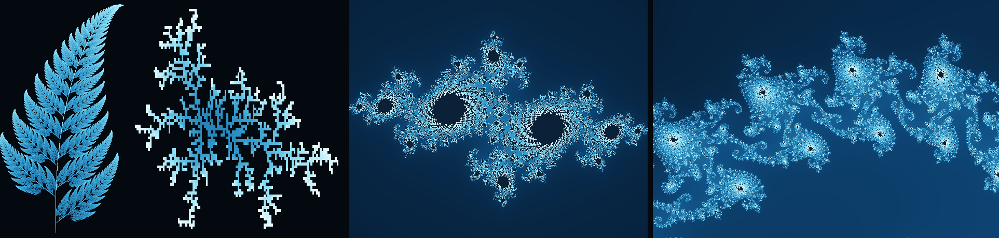

# web-3d-explore



two independent tracks. they share no code.

## math/

animated content on mathematics and neural-network foundations. one subject is a topic.

| topic | subject | state |
|---|---|---|
| 1 | fractals | 69 clips, about 20 minutes |
| 2 | differential equations, attractors and chaos | planned |
| 3 | calculus into a first neural network | planned |
| 4 | tokens, embeddings and generation | planned |

**`math/01-fractals/`** - the video series. eleven modules, ManimCE 0.20.1 at 480p15. every number
on screen is computed by the scene that shows it.

```sh
cd math/01-fractals
pip install -r code2/requirements.txt
manim -pql code2/topic05.py FernIFS
```

**`math/web-math-fr/`** - the site. FastAPI, PostgreSQL, alembic, `uv`; React 19, Vite, TypeScript,
three.js. seven systems with sliders and equations. every calculation a slider moves runs in the
browser; one websocket route handles Mandelbrot zooms past 10<sup>5</sup>, where single precision
on the graphics card runs out.

```sh
cd math/web-math-fr/math-fr-be && docker compose up -d --build   # api 1585, db 1586
cd ../math-fr-fe && npm ci && npm run dev                        # site 1263
```

## web-s-r/

real-time web transport and 3D rendering. websockets, webrtc, three.js. nothing built yet.

---

rendered clips and manim's intermediate output are not in the repository; every clip comes from
`code2/` by one command. the banner is rebuilt by
`python math/01-fractals/tools/readme_banner.py`.
